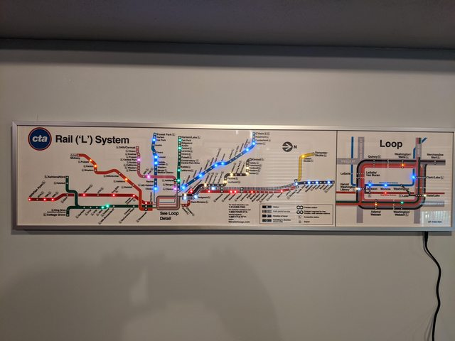

# Real-Time, Real World MBTA Tracking Map
This project aims to create a physical copy of the Massachusetts Bay Transportation Authority (the MBTA, or colloquially, the T.) Rapid Transit Map that allows for tracking of trains in real-time. Each station on the map is to be represented by an individual LED that shows where trains/trolleys/busses currently are in the system.

This project is heavily inspired by a [similar project created by reddit user Vonmule](https://www.reddit.com/r/DIY/comments/pyu07e/i_made_an_led_backlit_cta_map_that_displays/) for the Chicago public transportation system, shown below:

## Background

### Data Sources

This public pulls data from two main sources:
* For real time information on vehicle positions, the [MBTA V3 API](https://api-v3.mbta.com/) is used.
* For more generic route information and to decode stop IDs from the MBTA API, the [Transitland REST API](https://www.transit.land/documentation/rest-api/)

For the scale of data being accessed for this project, both APIs are free to use with an API key. Both also contains wealths more information than is being taken advantage of in this process, so check them out if you're interested!

## Electronics
Each station on the map is to be represented by a line-appropriate 3mm LED. 3mm LEDs were chosen as they result in a scaled version of the map that is just about the right size (18x18 with the station dots reduced to hold a 3mm LED.)

Given the small LED size and the inconsistency with their spacing, I was unable to develop a more efficient approach to the electronics than individually installing and wiring all LEDs. If you have a better idea that doesn't involve nearly as much wiring, I'd love to hear it!

As for controlling several hundred LEDs individually, I based my design on this [Adafruit 24-channel LED driver board](https://www.adafruit.com/product/1429) based on the [TLC5947 IC](https://www.ti.com/lit/ds/symlink/tlc5947.pdf?ts=1678238206668&ref_url=https%253A%252F%252Fwww.ti.com%252Fproduct%252FTLC5947). Each driver board controls 24 individual LEDs and they can easily be daisy chained together using the SPI interface. My implementation requires a LOT of these boards - 8 all together. This could be reduced by creating a unique circuit using a bigger IC, but that is a future improvement - more information in the section below.

To save on cost, I assembled these PCBs myself based on the schematic and board design files Adafruit provides in their GitHub, linked from the product page. If you're interested in assembling your own PCBs (fair warning, it contains some very tiny SMD components), and want to save as much money as possible, I used [this guide](https://youtu.be/mw0mskVCvis) to laser cut my own PCB stencils using the laser cutters at my college's shop. This professor has lots of great resources on hand-assembling SMD circuits - go check it out!

Electronics Assembly - WIP - for some resources, check out [Vonmule's build log here.](https://imgur.com/gallery/css6Twu)

## Notes on Train Positions
For this map, the direction of travel is disregarded and trains traveling both directions are shown simultaneously on the map. The LED for a station will light up if a train traveling either direction is currently stopped or in transit to it.

## Opportunities for Future Improvement
* Texas Instruments makes another version of the same IC used for the Adafruit boards that can drive 48 LED channels, [the TLC5955](https://www.ti.com/lit/ds/symlink/tlc5955.pdf?ts=1678250191592&ref_url=https%253A%252F%252Fwww.ti.com%252Fpower-management%252Fled-drivers%252Frgb-led-drivers%252Fproducts.html). Using this IC instead would cut the number of boards/ICs needed in half. Given the time-frame for this project, I did not want to design my own PCB and chose to use the Adafruit PCBs for simplicity, but it would definitely be more cost effective to use these larger ICs and perhaps place them all on a single PCB.
